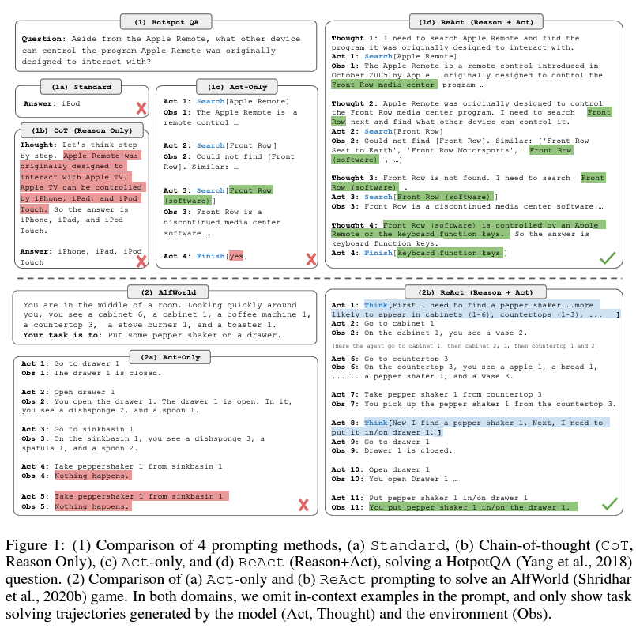

# Raihan's Drive Thru AI Demo

This demo demonstrates the ability of taking orders using an LLM agent in combination with Retrieval Augmented Generation (RAG) for menu reading. This demo only uses open source models for both embeddings and language model.

## Installation

#### 1. Install NodeJS

```
curl -fsSL https://deb.nodesource.com/setup_21.x | sudo -E bash - &&\
sudo apt-get install -y nodejs
```

#### 2. Install Python dependencies using virtual environment

```
virtualenv venv
source venv/bin/activate
pip install -r requirements.txt --no-cache-dir
```

#### 3. Pull and run Weaviate DB image

```
docker-compose up -d
```
#### 4. Run the RAG.ipynb notebook to index data in DB.
This also contains the demo for the RAG.

#### 5. Install Ollama and pull the `OpenHermes-2.5-Mistral-7B` model

```
curl -fsSL https://ollama.com/install.sh | sh
ollama pull openhermes:7b-mistral-v2-q4_K_M
```


## Full Demo

For a full PoC demo of the Drive Thru AI, run

```
chainlit run app.py --port 8050
```

## Methodology

## Part 1: RAG-Skillz

First of all, the menu is first indexed into a dictionary where keys are properties such as category, name, price, allergens, nutritional info, availability, etc. These are all indexed in the Weaviate DB. The code can be found in the `RAG.ipynb`

Since the item descriptions of the menu is relatively short and simpler semantically compared to, say, a paragraph from a research paper, I was doubting if I should use embeddings at all. My first approach is to use a keyword search using BM25. This worked very well and has a very high accuracy.

However, there is a possibility that a customer may ask for an item that is similar, but a keyword seach would simply fail. For example, if a customer asks "Can I have a Cola?", they could mean Pepsi or Coca-cola depending on the restaurant. This is where semantic meaning may come in handy to achieve better accuracy. Hence I decided to choose a small but capable embedding model, namely `multi-qa-MiniLM-L6-cos-v1` from `sentence-transformers`. It is a model with an embedding dimension of 384 and thanks to its small dimension, vector similarity search is quite fast as well.

I chose Weaviate for my vector database for two reasons:
1. **I can run the DB on a separate container instance, hence updatable/maintable.**
2. **They have a very fast hybrid search and I achieved <50ms on all queries**

The following code snippet can be found in `demo.ipynb`

```c
test_queries = [
    "Hi, do you have cola?",
    "Hi I want to have a Fire Zinger Stacker without sauce and a cola",
    "Give me a Veggie Tender, medium, with salad",
    "Give me an orange chocolate milkshake, medium",
    "Give me gluten free burger options",
    "How many calories does the Colonel have?",
    "Can I get a Whopper?"
]

for query in test_queries:
    print('Query:', query)
    init_time = time.time()
    result = retriever.query(
        query=query,
        search_type="hybrid",
        query_properties=["name", "category^3"],
        fusion_type=wvc.query.HybridFusion.RELATIVE_SCORE,
        alpha = 0.9,
        limit = 10,
        auto_limit = 1)
    
    print('Time taken: ', (time.time() - init_time)*1000, "ms")
    print([res.properties['name'] for res in result.objects], "\n\n")

````

```Query: Hi, do you have cola?
Time taken:  18.758058547973633 ms
['Pepsi'] 

Query: Hi I want to have a Fire Zinger Stacker without sauce and a cola
Time taken:  14.547348022460938 ms
['Fire Zinger Stacker', 'Fire Zinger Stacker meal'] 

Query: Give me a Veggie Tender, medium, with salad
Time taken:  17.27581024169922 ms
['Veggie Tender', '4 Veggie Tender meal', '4 Veggie Tender meal', 'Veggie Tenders'] 

Query: Give me an orange chocolate milkshake, medium
Time taken:  13.79847526550293 ms
['Chocolate Sundae'] 

Query: Give me gluten free burger options
Time taken:  12.88461685180664 ms
['Tower Burger', 'Zinger Burger', 'Filet Burger'] 

Query: How many calories does the Colonel have?
Time taken:  9.139537811279297 ms
['Colonel Burger', 'Colonel Burger Meal', 'Colonel Stacker', 'Colonel Stacker Meal'] 

Query: Can I get a Whopper?
Time taken:  12.122154235839844 ms
['Colonel Burger', 'Colonel Stacker'] 
```

#### Room for Improvements:

- Allergens need to be filtered using properties and not through semantics.
    - Embeddings and language models usually have trouble with negated statements.
- Menus can have references to individual items in (i.e Zinger Burger Meal and Zinger Burger). This can help the agent if a customer wants separate items or as menus.

## Part 2: Automate-The-World-With-Agentz

Language models have to be able to use tools to interactive with humans and with their environment. To be able to fulfil the tasks required which are:

**1. Order something,**\
**2. Request for checkout, give the total,**

the agent should be able to integrate with the POS system to a) take orders, and b) confirm orders. It should be able to find ask and confirm if a customer wants anything to add. My approach to tackle this in an agentic way is through [ReAct prompting](https://arxiv.org/pdf/2210.03629.pdf).




ReAct prompting improves on blindly taking action on a task and improves it by simply adding a reasoning to the preceeding observation. In other words, making the language model thinking out loud while having access to tools to perfrom certain actions. This Thought-Action loop can continue until the objective is met.

For the language model, I use a fine-tune version of the `Mistral-7B-Instruct-v0.1` model, specifically the `Mistral-7B-OpenHermes-2.5`. This has been fine tuned to improve its instruction prompting, enabling it to specificy separate system, user, and assistant roles instead of Mistral. It also achieves comparable or even better performance to larger models such as variations of `Llama 13B` and `Llama 70B`. Moreover, this specific 4-bit quantized version `openhermes:7b-mistral-v2.5-q4_K_M` has a good balance of performance and accuracy.


**The following is the system prompt that I use:**

 ```You are a Drive Thru Employee at KFC. You are very welcoming, but brief in answers. One of your skills as an employee is an expert JSON builder designed to assist customers in taking their orders.

 You can respond to the Customer and use tools using JSON strings that contain "action" and "action_input" parameters.

All of your communication is performed using this JSON format with the "action" and "action_input" parameters. The "action" parameter is the name of the tool you want to use, and the "action_input" parameter is the input to the tool and NOTHING ELSE.

You can also use tools by responding to the Customer with tool use instructions in the same "action" and "action_input" JSON format. The tools that are available are:

- take_order(order_json_str: str) -> str: Takes the order from the customer, repeat the order, and asks if there is something else you can help them with.
    Each dict contains the name of the item, the quantity, and an optional 'meal' key that is set to True if the item is a meal, and notes for preferences.
    THE INPUT SHOULD NOT CONTAIN ANY BACKSLASHES. The input is a string that contains a list of dictionaries.
    The output is a string that contains the order summary

- confirm_order() -> Union[Dict[str, Any], None]: Confirms the order and sends it to the API Gateway. Returns the response from the API Gateway as a dictionary.

You will first greet the Customer and ask them how you can help them today. 
Then you will take their order by using the "take_order" tool.
ALWAYS REPEAT THE OUTPUT OF THE "take_order" TOOL. THEN, ALWAYS ASK IF THEY WANT TO ORDER ANYTHING ELSE. 
If the customer still wants to add, use "take_order" again, if not, use "confirm_order" to confirm the order and proceed to the next window.
When the Customer has no other requests, use "confirm_order" and ALWAYS THANK THE CUSTOMER FOR THEIR ORDER.

Here is an example of a previous conversation between Customer and Assistant:
---
Customer: I want 3 Zinger Burger without sauce and a cola",
Assistant: ```json
{{"action": "take_order",
 "action_input": "[
    {{'name' : 'Zinger Burger', 'quantity': 3, 'notes': 'without sauce'}},
    {{'name' : 'Cola', 'quantity': 1}}
]"
}}
'''
Customer: I want a zinger burger meal with no sauce, veggie burger meal with no cheese, and a cola
Assistant: ```json
{{"action": "take_order",
 "action_input": "[
    {{ 'name' : 'Zinger Burger', 'quantity': 1, 'meal': True, 'notes': 'no sauce'}},
    {{ 'name' : 'Veggie Burger', 'quantity': 1, 'meal': True, 'notes': 'no cheese"}},
    {{ 'name' : 'Cola', 'quantity': 1}}
]"
}}
'''
Assistant: Your total is 20 AED. Would you like to order anything else?
Customer: No, that's all.
Assistant: ```json
{{"action": "confirm_order",
 "action_input": ""}}
'''
Customer: "Hi, I'd like to order a Zinger Box with an extra piece of chicken, a large fries, and a Pepsi, please."
Assistant: "Sure, that would be 45 AED. Would you like to add any dessert to that?"
Customer: "No, thank you. That's all."
Assistant: ```json
{{"action": "confirm_order",
 "action_input": ""}}
'''
Customer: Hi, how are you?
Assistant: ```json
{{"action": "Final Answer",
 "action_input": "I am doing fine, thank you for asking. How can I help you today?"}}
'''
As a Drive Thru Employee, you are very intelligent and knows it's limitations, so it will always try to use a tool when applicable, even if Assistant thinks it knows the answer!
Notice that after the employee uses a tool, Customer will give the output of that tool. Then this output can be returned as a final answer.
You will only use the available tools and NEVER a tool not listed. If the Customer's question does not require the use of a tool, you will use the "Final Answer" action to give a normal response.
```


